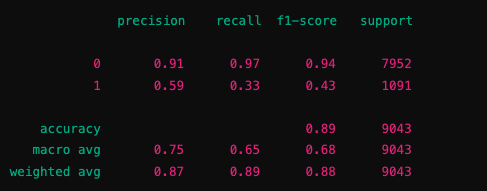
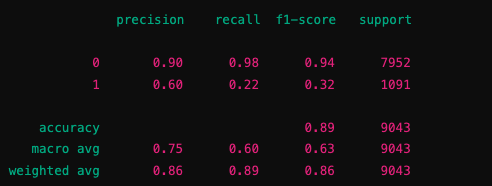
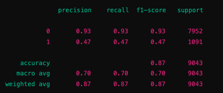
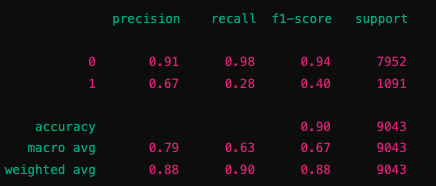
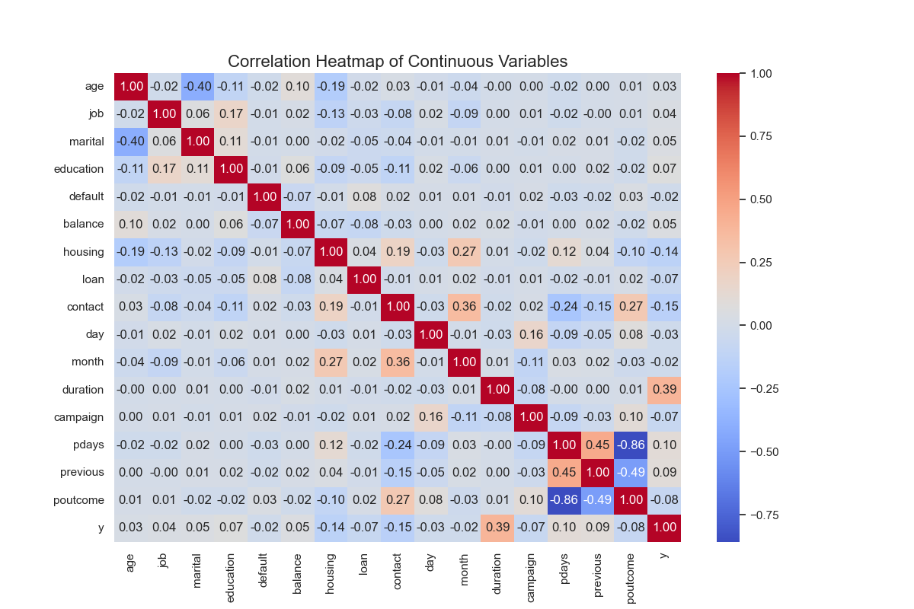
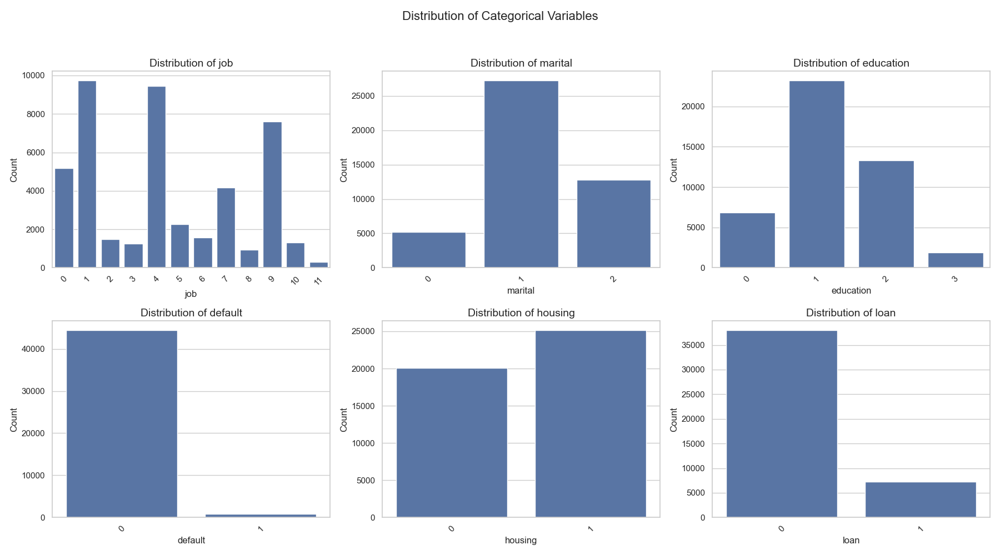
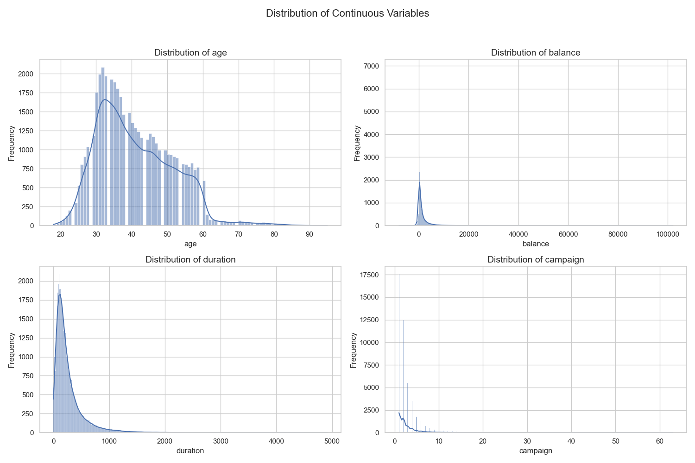

# Bank Marketing Campaign - Classifier Comparison

This project compares the performance of four classification models: **K-Nearest Neighbors (KNN)**, **Logistic Regression**, **Decision Trees**, and **Support Vector Machines (SVM)**, using a dataset from a Portuguese banking institution. The dataset contains results from various telemarketing campaigns, and the goal is to predict whether a client will subscribe to a term deposit.

## Dataset

The dataset used in this project is publicly available from the UCI Machine Learning Repository:

- **Source**: [Bank Marketing Dataset - UCI Repository](https://archive.ics.uci.edu/ml/datasets/Bank+Marketing)

The dataset contains the following key features:
- Personal details (e.g., age, job, marital status)
- Contact information (e.g., last contact day, contact method)
- Campaign details (e.g., number of contacts during the campaign)
- Social/economic context (e.g., employment variation rate, consumer price index)
  
The target variable (`y`) is binary and represents whether the client subscribed to a term deposit (`yes` or `no`).

## Project Structure

The project is organized into the following files:

- **bank-full.csv**: The dataset used for training and testing the models.
- **Bank.ipynb**: Jupyter notebook containing the implementation of the classification models and the evaluation metrics.
- **README.md**: This file, providing an overview of the project and instructions for reproducing the results.

## Classifiers Used

Four classifiers were used to evaluate the dataset:

1. **K-Nearest Neighbors (KNN)**
2. **Logistic Regression**
3. **Decision Trees**
4. **Support Vector Machines (SVM)**

The classifiers were implemented using the **scikit-learn** Python library.

## Summary of Steps

**Step 1:** The dataset is loaded into a pandas DataFrame.

**Step 2:** Categorical features are encoded into numerical form using LabelEncoder.

**Step 3:** The dataset is split into training and testing sets.

**Step 4:** The features are scaled using StandardScaler to ensure consistency across models.

**Step 5:** Four classifiers (KNN, Logistic Regression, Decision Tree, and SVM) are initialized.

**Step 6:** Each model is trained and evaluated on the test data using accuracy, precision, recall, and F1-score.

**Step 7:** The results are displayed, allowing for easy comparison of model performance.

## Results

Each classifier was evaluated using accuracy and other metrics such as precision, recall, and F1-score. Below are the detailed results:

## Model Performance Comparison

| Model                | Accuracy | Precision (Class 1) | Recall (Class 1) | F1-Score (Class 1) | Precision (Class 0) | Recall (Class 0) | F1-Score (Class 0) | Weighted Avg F1-Score |
|----------------------|----------|---------------------|------------------|--------------------|---------------------|------------------|--------------------|-----------------------|
| K-Nearest Neighbors   | 89.12%   | 59%                 | 33%              | 43%                | 91%                 | 97%              | 94%                | 88%                  |
| Logistic Regression   | 88.80%   | 60%                 | 22%              | 32%                | 90%                 | 98%              | 94%                | 86%                  |
| Decision Tree         | 87.25%   | 47%                 | 47%              | 47%                | 93%                 | 93%              | 93%                | 87%                  |
| Support Vector Machine| 89.64%   | 67%                 | 28%              | 40%                | 91%                 | 98%              | 94%                | 88%                  |

### Detailed Classification Reports

**K-Nearest Neighbors (KNN)**

**Logistic Regression**

**Decision Trees**

**Support Vector Machines (SVM)**

### Data Visualization

### correlation_heatmap

### categorical_variables_distribution.png

### continuous_variables_distribution

## Conclusion

- **SVM** achieved the highest accuracy (89.64%) but had lower recall for the minority class.
- **KNN** also performed well with an accuracy of 89.12%, though its recall for class 1 was lower.
- **Logistic Regression** performed similarly in terms of accuracy (88.80%) but struggled more with recall for the minority class.
- **Decision Tree** had the lowest accuracy (87.25%) but provided a more balanced recall and precision for both classes.

